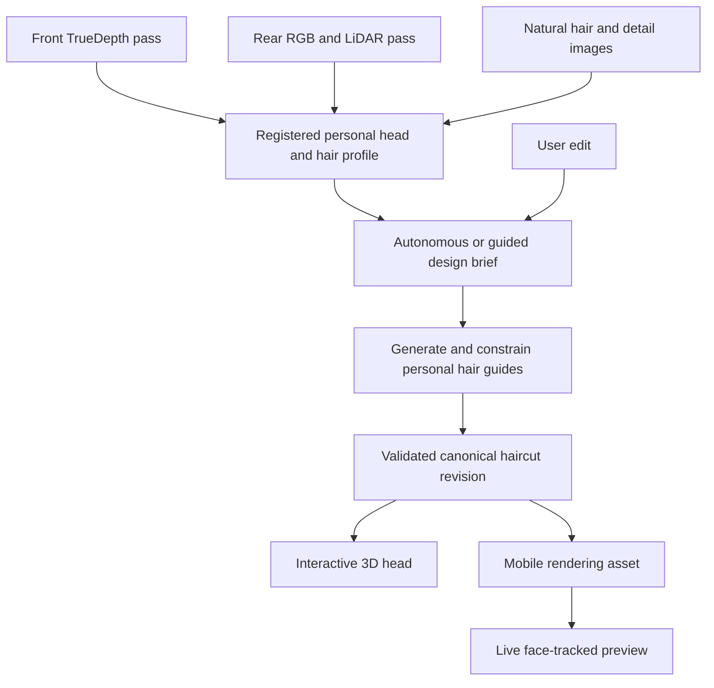

# Personalized Hair: product and technical specification

Version: 0.1 · Date: 2026-09-10 · Status: proposed implementation baseline

This document records the agreed product intent and proposes a concrete implementation. Statements marked **confirmed** reflect the design discussion. Statements marked **proposed** are defaults for implementation, not measured capabilities or additional user approvals. Research candidates require evaluation before adoption. Acceptance targets and experiments are in the [implementation plan](implementation-plan.md).

## 1. Product promise

**Generate a haircut for this person, using their head geometry, visible hair characteristics, and optional preferences. Let them inspect and edit that same haircut in 3D and try it on live.**

Personalization must affect the design itself: regional lengths, layering, part placement, fringe, direction, and volume. Uniformly scaling an existing hairstyle to a head is insufficient. A catalog can supply design vocabulary or training examples, but it is not the source of final user assets.

The experience is a consumer-oriented technology preview. It demonstrates a plausible personalized design and explains practical conditions. It does not guarantee exactly how a real haircut will fall, and it does not claim to discover a single objectively ideal hairstyle.

### 1.1 Confirmed decisions

| ID | Decision |
|---|---|
| D01 | Build a native iOS app. |
| D02 | Use an assisted rear-camera scan with LiDAR for general head coverage, plus a front TrueDepth facial pass. |
| D03 | Capture geometry with hair gently tied or pinned back. Capture natural hair separately, with targeted close-ups as needed. |
| D04 | Analyze facial proportions and visible hair structure, direction, and hairline. Record uncertainty and support corrections. |
| D05 | Provide autonomous analysis/design and a guided mode with preferences and edits. |
| D06 | Generate a custom 3D haircut for each person. |
| D07 | Show the same generated haircut on the scanned 3D head and in a live front-camera preview. |
| D08 | Prioritize a consumer technology preview over salon business workflows. |

TrueDepth is the front depth system; it is not front-facing LiDAR. “Hair attachment” refers to the hairline and locations where hair grows from the scalp. Individual hidden follicles are not measurable through hair with this workflow.

### 1.2 Proposed preview scope

The preview includes capture guidance, scan review, generated proposals, explanations, 3D inspection, local controls, natural-language edits, live preview, session saving, deletion, and explicit export of comparison images and a design summary.

Use cloud GPU processing for reconstruction and generation initially. Keep capture, immediate quality guidance, asset display, and live tracking on the device. Permit saved results to be viewed offline after download. New generation requires connectivity.

The first complete demo may support a deliberately narrow, documented hair domain. It must still generate individual geometry. Broader texture coverage is a validation milestone, not an unverified launch claim.

Deferred: salon scheduling and payments, social feeds, automatic cutting instructions suitable for execution without stylist judgment, photorealistic loose-hair removal in every live scene, full hair physics, full offline generation, and fully solo rear-head scanning.

## 2. Experience and screens

### 2.1 Primary journey

1. **Welcome and capability check:** explain the outcome, confirm compatible cameras, explain assisted capture and cloud processing.
2. **Preparation:** hair gently pinned back, forehead and ears visible, diffuse light, neutral expression, glasses and obstructing accessories removed where practical.
3. **Face capture:** a front-camera head-turn guide captures usable facial depth and images.
4. **Head capture:** another person walks around the seated subject using the rear camera. Coverage guides the operator around sides, back, crown, ears, and neck.
5. **Natural hair:** release hair, let it settle, and capture front, both sides, back, and crown. Show close-up prompts only where helpful.
6. **Scan review:** rotate the head model, inspect missing regions, and accept or repeat a pass. Highlight estimated areas in an optional inspection overlay.
7. **Design mode:** choose “Design for me” or “Guide the design.” Autonomous is the proposed default.
8. **Generation:** show actual stages and allow leaving/resuming the job. Never display invented completion percentages.
9. **Proposals:** show up to three distinct, validated custom designs with reasons and practical requirements.
10. **Explore and edit:** inspect the 3D head, compare designs, adjust controls, or request an edit in natural language.
11. **Try live:** align the asset to the face tracker; use pinned-back hair for the initial preview scope.
12. **Save or export:** save the selected revision, comparison views, and a plain-language design summary.

Allow users to select design mode earlier, but do not require preference answers before capturing. The scan subject and camera operator are distinct roles; the subject grants consent and owns the result. Initial scope is one subject/session on one device, with device handoff to the operator.

### 2.2 Autonomous mode

Autonomous means no mandatory hairstyle questionnaire or manual candidate selection before generation. Capture still requires physical participation, and the rear pass still needs an operator.

Proposed defaults: preserve natural color and texture; avoid assuming chemical treatment or extensions; target low-to-moderate daily styling; prefer designs achievable with current length when evidence supports that judgment. Record these as defaults, not inferred personal preferences. Do not infer gender identity, ethnicity, personality, or lifestyle to select a haircut.

Generate a conservative option, a more substantial change, and an exploratory alternative when enough valid diversity is available. If an alternative needs growth or special styling, label it. Never manufacture three options when only one or two pass validation.

Unknown properties are carried through as estimates and may limit the proposal. Optional confirmations can improve later results. Insufficient capture must trigger targeted recapture or a clearly reduced-confidence result, rather than fabricate measurements.

### 2.3 Guided mode

Optional preferences: desired length range, willingness to grow hair, styling effort, tool/product use, maintenance frequency, preferred silhouette, keep/change requests, and reference images.

Supported initial edits: fringe length, side volume, top length/volume, part location, exposed ears, and color visualization. Show achievable ranges derived from the current design and profile. Natural-language requests compile into the same edit controls and constraints.

Examples: “Keep the crown direction but shorten the fringe”; “Show more of my ears”; “Give me less volume at the sides.” Ambiguous requests can generate a small comparison or a concise clarification. Changes that require a new cut design create a new revision.

### 2.4 Presentation and accessibility

Each proposal shows its appearance, rationale, estimated feasibility, maintenance assumptions, and unresolved observations. Avoid attractiveness scores and false numerical certainty. A photo concept is labeled as a concept until reconciled with the 3D asset.

Capture uses visual, spoken, and haptic guidance with user controls; color alone never indicates quality. Support VoiceOver for navigation and controls, scalable text, reduced motion, and a capture workflow that can pause or adapt to limited head/arm mobility. Accessibility alternatives can require an operator or omit inaccessible views with an explicit quality impact.

## 3. Capture and device contract

### 3.1 Hardware support

Proposed initial eligibility requires both a rear LiDAR-capable configuration and a front TrueDepth depth-capture format. Probe capabilities at runtime rather than infer support from a marketing model name. AR face-tracking availability alone does not establish TrueDepth capture availability.

Record device model, OS/build, active camera formats, image/depth dimensions, filtering configuration, and supported AR frame semantics. Choose the minimum iOS release and named device matrix during M0 using actual devices. Unsupported devices receive a clear compatibility screen; no low-quality fallback is silently substituted.

Apple exposes synchronized front image/depth capture through AVFoundation and rear scene depth through ARKit. The built-in AR face mesh is useful for tracking and initial alignment; it is not a complete head scan. See [TrueDepth capture](https://developer.apple.com/documentation/avfoundation/streaming-depth-data-from-the-truedepth-camera), [scene depth](https://developer.apple.com/documentation/arkit/arconfiguration/framesemantics-swift.struct/scenedepth), and [face geometry](https://developer.apple.com/documentation/arkit/arfacegeometry).

### 3.2 Pass requirements

| Pass | Input | Guidance and checks | Output |
|---|---|---|---|
| Front face | Synchronized RGB and available TrueDepth depth/calibration | Neutral expression; slow comfortable yaw/pitch; usable depth, blur and exposure checks | Face views with depth validity and pose estimates |
| Rear head | RGB, available LiDAR depth/confidence, camera intrinsics and AR poses | Subject seated and still; operator follows coverage guide; mask background and moving regions | Overlapping head views and metric geometry evidence |
| Natural hair | RGB views, optional available depth | Dry hair in its normal state; record product, wetness, and styling as unknown unless supplied | Appearance, segmentation and orientation evidence |
| Details | Focused RGB images | Hairline, temples, crown, optional partings; avoid pulling roots out of their normal state | Local evidence for uncertain observations |

Start with experiment targets of roughly 20–40 seconds for the front pass and 45–90 seconds for the rear pass. These are workflow hypotheses, not camera guarantees. Derive distance bands and angular coverage thresholds empirically; do not hard-code unsupported precision claims.

A bun, clip, or ponytail is segmented as an obstruction. Its surface must never become the estimated skull surface. Hair pushed back can still obscure the scalp and change the apparent hairline under tension.

### 3.3 Registration and motion

Front, rear, and natural-hair passes are separate sessions with separate coordinate systems. Initial scope does not require concurrent front/rear camera capture.

Rear AR camera poses describe motion relative to the environment. They do not compensate for a subject moving within that environment. Reject affected frames or estimate head-relative motion before fusion. Front head turns similarly require per-frame head pose; integrating depth using only phone pose would smear the face.

Use stable facial landmarks for coarse alignment, then robust overlap fitting on visible skin geometry. Resolve scale from calibrated depth. Record transforms, residuals, overlap, and confidence. Downweight expressions, hair, and occluded surfaces. Do not force-align an incompatible or insufficiently overlapping pair of scans.

Create a canonical head frame: origin at the midpoint between estimated eye centers, +X toward the subject's anatomical left, +Y upward, +Z anterior/outward from the face. Store all coordinates in meters and explicit transforms from each source. Camera mirroring is presentation-only and must never swap anatomical left/right in design data. Unit-test projection, transform direction, and parity using an asymmetric calibration fixture.

Apple warns that deformation between photographs can degrade Object Capture reconstruction. Treat general photogrammetry as an experimental baseline, not a guaranteed person-scanning solution. [Apple capture guidance](https://developer.apple.com/documentation/realitykit/capturing-photographs-for-realitykit-object-capture)

### 3.4 Quality and recovery

Track coverage by region, depth validity, sharpness, exposure consistency, segmentation quality, motion, landmark agreement, and registration residual. Preserve regional quality; a single global score must not hide a missing crown or profile.

If a pass fails, explain the observable cause and retry only the affected pass/region. Camera interruption, backgrounding, calls, permission changes, and thermal pressure pause capture with recoverable state. Never fuse a partial pass automatically without checking quality.

## 4. Personal head and hair profile

Maintain separate representations for observed surfaces, fitted geometry, and inferred completion. A smooth reconstructed surface is not proof that the underlying shape was observed.

| Property | Evidence and interpretation |
|---|---|
| Facial proportions | Landmarks and calibrated visible geometry; retain uncertainty and capture conditions |
| Head, ears and neck | Observed geometry plus fitted completion where coverage is missing |
| Hairline | Visible boundary with per-segment quality; obscured sections inferred or user-corrected |
| Part and visible flow | Image orientation and segmentation; distinction between styled flow and root growth |
| Texture and curl | Regional visual descriptors; lighting, products, wetness and styling can alter appearance |
| Length | Visible lengths and optional user estimates; hidden strand length generally unknown |
| Density and thickness | Apparent coverage/visual proxies only unless supported by separate evidence |
| Crown growth/cowlicks | Estimates from targeted views; permit stylist/user correction |
| Scalp and roots | Scalp model and plausible root distribution; not follicle-level measurement |

Every observation stores value, units where relevant, region, evidence references, provenance (`observed`, `inferred`, `user_supplied`, or `default`), quality state, and method/version. Use unknown values explicitly. “High/medium/low” is an evidence-quality category until calibration supports a stronger statistical interpretation.

User correction creates a new profile revision and preserves the original evidence. Recompute dependent features/designs and flag stale results; never silently mutate a saved haircut.

## 5. Personalized design and generation

### 5.1 Responsibilities

| Component | Responsibility | Boundary |
|---|---|---|
| Vision models | Segmentation, landmarks, visible direction and texture evidence | Must expose missing evidence and uncertainty |
| Multimodal LLM | Convert observations/preferences into structured design proposals and explanations | No authority to invent measurements or bypass constraints |
| Image generation | Optional visual exploration or conditioning for a candidate | Output is an appearance hypothesis, not 3D truth |
| 3D hair generation | Produce person-conditioned guide curves/strands | Must attach to the personal scalp and respect design controls |
| Geometry/constraint solver | Fit, edit and validate length, roots, clearance and silhouette | Reject violations and record unverifiable properties |
| Renderer/compiler | Produce inspection views and efficient mobile assets | Must preserve design identity and revision |

### 5.2 Generation pipeline

1. Build the personal profile from evidence and optional corrections.
2. Build a design brief containing preferences/defaults, uncertain properties, allowed changes, and feasibility mode.
3. Propose candidate regional lengths, layering, parting, fringe, silhouette and styling assumptions. Use user preference, hair behavior evidence, and explicit aesthetic heuristics; do not present face-shape rules as objective science.
4. Optionally create concept images conditioned on the person and candidate. Check identity/landmark preservation. Reject face or hairline alterations that contradict the input contract.
5. Generate 3D guides directly, or reconstruct guides from a concept using a selected research pipeline. Fit to the personal scalp and hairline. Infer unseen structure with provenance.
6. Optimize candidate guides against person-specific geometry, visible growth constraints, texture, available length bounds, and target silhouette. Separate physical constraints from aesthetic ranking.
7. Validate attachment, anatomical consistency, forbidden intersections, lengths, continuity, and feasibility labels. Penalize collapse into near-duplicate candidates.
8. Render standardized front, profile, rear and three-quarter views. Check cross-view consistency and compare to the design brief.
9. Rank eligible candidates using explicit rules/preferences and experimental learned scoring. An LLM explanation describes actual accepted parameters and evidence, not a speculative post-hoc justification.
10. Save the canonical haircut revision, generate mobile derivatives, and publish only a fully validated asset manifest.

Use bounded retries: proposed maximum two repair attempts per failed candidate and three candidate slots per job. A budget/timeout may produce fewer designs. Preserve failure reasons for evaluation; never substitute a stock asset or unrelated generated image while claiming success.

### 5.3 Customization contract

Each haircut is generated in the person's canonical head frame and references their profile revision. It contains regional length fields, part curves, direction controls, density/texture parameters, root attachment data, guides, and feasibility conditions.

Personalization must survive these checks: changing person-specific measurements while holding design intent and seed constant changes relevant design parameters; the resulting geometry respects the new head and hair evidence; the pipeline does more than apply an overall transform. Regional changes should be explainable without exposing unnecessary implementation detail to the user.

A “cut” and a “styled result” are related but different outputs. Store both cut parameters and styling assumptions. Curvature and final volume depend on texture, gravity, products and drying; do not label a rendered arrangement as a verified physical prediction. Reference concept images must not replace missing evidence about the person's actual hair.

### 5.4 Feasibility modes

| Status | Meaning |
|---|---|
| `supported_by_observations` | No detected conflict with sufficiently supported current-hair constraints; still a preview |
| `requires_growth` | Some target regions exceed known current lengths |
| `requires_styling` | Target assumes tools, products, or a changed arrangement |
| `requires_extensions_or_treatment` | Explicitly assumes added hair or texture-changing treatment |
| `uncertain` | Relevant lengths, growth or material properties are missing |

Statuses can combine. “Supported” is not a guarantee. A numerical growth timeline is omitted unless a future feature has defensible inputs. Separate color visualization from cutting feasibility.

### 5.5 Research candidates and boundaries

[HAAR](https://haar.is.tue.mpg.de/) demonstrates text-conditioned strand generation and is a candidate starting point for generating guides. Its published capabilities do not establish the required person-specific haircut optimization.

[Gaussian Haircut](https://arxiv.org/abs/2409.14778) combines explicit hair strands with strand-aligned Gaussians for reconstruction and rendering. Evaluate it for recovering existing appearance and for rendering, while distinguishing reconstruction of current hair from design of a new cut.

[Strand-based Hairstyle Generation via Large Reconstruction and Multimodal Models](https://arxiv.org/abs/2608.13679) is a recent research candidate for image-to-strand generation. Its reported results require reproduction on our captures; runtime, code availability, weights, licenses and hardware requirements are unverified.

Choose a model only after a capability and license inventory. Keep provider/model adapters so experiments can change without changing app-level session and asset contracts. Custom output generation still depends on rights to the code, weights, datasets and input images used.

## 6. Canonical haircut and preview representations

The canonical asset is a scalp-bound guide/strand representation plus editable design parameters. An individual root is stored as a scalp triangle reference and barycentric coordinates, with any offset explicit. Guides are ordered 3D points with material/region identifiers. Inferred density is recorded as an assumption.

Derived representations may include denser strands, hair cards (textured ribbons for efficient rendering), conventional meshes, and optional aligned Gaussians. Preserve head ID, haircut ID, revision and hash across derivatives. A generic splat cloud may be used for reference appearance, but cannot be the sole editable haircut representation.

### 6.1 Interactive 3D viewer

Rotate, pan, zoom, reset, compare candidates, switch saved revisions, and inspect front/profile/back views. Offer optional head-only and evidence-quality overlays. Keep material, camera, and lighting consistent during comparisons.

Initial controls modify a supported bounded set of parameters. Fast local changes are marked provisional until validated; the last committed revision remains available. Generation edits run asynchronously. Undo restores the exact previous revision. A later-arriving response must not replace a newer user edit.

Preserve face identity and anatomy. Estimated back-of-head or scalp surfaces can be rendered naturally but must be inspectable as inferred. Exported comparison images identify preview status and assumptions.

### 6.2 Live front-camera preview

Align the canonical head frame to AR face tracking using a brief neutral-face calibration, stable landmarks, and a persistent fitted transform. Apply tracking changes to the head root; facial expression blend shapes must not stretch the hairstyle as though it were facial skin. Large alignment changes require recalibration.

The session camera and tracking images drive the live presentation. Use segmentation and available geometry/depth to handle occlusion around forehead, ears and face, with stable temporal filtering. Hand occlusion and profile limits require explicit tests. On tracking loss, fade the overlay and guide reacquisition rather than leave a floating hairstyle.

For the first preview, the subject pins existing hair back. This does not fully hide a bun, long ponytail, or hair outside the generated silhouette. Detect or disclose residual visible hair; limit the supported framing/turn range where necessary. A cap that hides roots is not equivalent to hairline capture.

Live loose-hair removal is a later pipeline requiring temporally consistent segmentation and reconstruction of newly exposed skin/background. Independent per-frame image generation is not the initial renderer.

Proposed renderer strategy: evaluate conventional mobile hair cards/strands first and add a custom Metal Gaussian path only if it improves quality within the device budget. Preview and viewer must derive from the same haircut revision, even if their rendering quality differs.

## 7. System architecture

### 7.1 iOS modules

| Module | Responsibility |
|---|---|
| App shell | SwiftUI navigation, session ownership, accessible controls |
| Capture | AVFoundation front capture, ARKit rear depth capture, calibration and interruption handling |
| Quality | Immediate checks, coverage and recapture instructions |
| Local store | Protected capture files, session manifests, checkpoints and downloaded results |
| Transfer | Resumable uploads, integrity checks and authorized downloads |
| Jobs | Submit, observe, cancel and resume processing jobs |
| Viewer | Personal head and haircut display, comparison and bounded edits |
| Live preview | Face tracking, alignment, occlusion and rendering |

Camera ownership is serialized. Capture sessions and live AR sessions release resources before switching. Keep capture code independent of generation providers. Use recorded fixtures for non-camera development; hardware gates run on actual iPhones.

### 7.2 Backend modules

Proposed implementation uses a typed HTTP API, durable job queue, relational metadata store, encrypted object storage, and containerized Python GPU workers. PyTorch and geometry tooling are candidates where model integrations require them; package versions and hosting provider are chosen after M0. This specification does not provision or select a paid provider.

Worker stages: input validation, reconstruction/registration, observations, design planning, generation, constraint validation, asset compilation and publishing. Jobs checkpoint each expensive stage and run independently of an open app connection. External model calls are server-side with scoped credentials and redacted diagnostics.

Persist immutable inputs/versions and seed where supported. Best-effort regeneration may vary across hardware/model services; saved output assets are the source of truth for exact replay.

### 7.3 Session and job state

Session stages: `draft → capturing → capture_review → ready_for_processing → processing → ready`. Recoverable detours include `capture_incomplete`, `needs_recapture`, and `processing_failed`. Deletion transitions to `deleting → deleted`; results must not be republished after deletion.

Job states: `queued`, `running`, `needs_input`, `succeeded`, `failed`, `cancel_requested`, `cancelled`. Include stage, latest checkpoint, retry count, failure code, timestamps and resource usage. Progress reports known completed stages; stage duration estimates are displayed only after enough measured runs.

Queue delivery may repeat: stage execution and asset publication must be idempotent. Generation requests include an idempotency key plus input hashes. Cancellation blocks future publication; already-running provider calls may need to finish before their outputs can be discarded.

### 7.4 Data contracts

| Entity | Required fields |
|---|---|
| Session | ID, owner ID, consent version, state, created/updated times, retention/deletion state |
| CapturePass | ID, session ID, type, device/OS, camera formats, evidence manifest, quality report, revision |
| FrameEvidence | Timestamp, RGB/depth references, validity/confidence if available, intrinsics/calibration, pose source, transform convention, orientation, hash |
| HeadProfile | ID/revision, head/scalp/ear meshes, canonical frame, source transforms, landmarks, regional evidence, inferred-region mask |
| HairProfile | ID/revision, hairline, flow/part observations, texture/length/coverage descriptors, provenance and uncertainties |
| DesignBrief | Profile revisions, mode, preferences/defaults, allowed changes, feasibility constraints, seed, schema version |
| Haircut | ID/revision, head/profile references, brief hash, scalp attachments, guides, regional parameters, styling assumptions, validation report |
| AssetManifest | Haircut revision/hash, canonical and mobile assets, materials, bounds, units, coordinate convention, compiler version, integrity hashes |
| Job | ID, owner/session, input hashes, model/code versions, state/stage, checkpoints, usage/cost, output references |
| Edit | Base haircut revision, structured operations, original user request if retained, result revision, validation status |

Unknown fields are nullable or explicitly `unknown`; do not encode missing length as zero. Use versioned JSON manifests with binary geometry/image payloads. Preserve sensor depth separately from display textures. Compression must preserve calibration and chosen precision; record format and conversions.

### 7.5 Proposed API

| Endpoint | Behavior |
|---|---|
| `POST /v1/sessions` | Create owned session and record consent version |
| `POST /v1/sessions/{id}/uploads` | Issue scoped upload instructions for declared evidence objects |
| `POST /v1/sessions/{id}/captures:finalize` | Verify uploaded hashes, completeness and manifest schema |
| `POST /v1/sessions/{id}/reconstructions` | Enqueue reconstruction and analysis from finalized captures |
| `POST /v1/sessions/{id}/designs` | Enqueue candidates from selected profile revisions and brief |
| `GET /v1/jobs/{id}` | Return durable state, stage, recoverable failures and outputs |
| `POST /v1/jobs/{id}:cancel` | Request cancellation and suppress result publication |
| `GET /v1/haircuts/{id}/revisions/{revision}` | Return authorized immutable manifest/download references |
| `POST /v1/haircuts/{id}/edits` | Submit operations against an explicit base revision |
| `DELETE /v1/sessions/{id}` | Revoke access and enqueue cascading deletion |

All operations verify ownership. Bound input size and allowed formats, validate server-side, and prohibit arbitrary external fetch URLs in manifests. Idempotent request retries must not duplicate GPU spend. Events/push notifications are optional enhancements; polling with backoff and app-resume refresh is sufficient initially.

## 8. Privacy, consent and operational behavior

Proposed default: local session creation without mandatory email registration; backend access uses an owned guest identity and a device-protected secret. Account recovery and multi-device sync are deferred. Explain that losing guest credentials can lose access. Do not use face recognition to establish ownership.

Before upload, the subject agrees to cloud processing and sees what is stored. The camera operator cannot substitute their consent for the subject's. No face or hair captures are used for training by default. Research-data retention requires a separate opt-in and purpose.

Proposed retention: working raw captures automatically expire within 24 hours after successful processing, and abandoned/failed uploads within 7 days. Saved profiles and generated assets persist until deleted. Deleting raw evidence limits future reanalysis; the app explains when a rescan is required. Local raw caches follow the same policy unless the subject explicitly saves a research fixture.

Deletion immediately revokes access, cancels jobs, clears local caches and schedules primary-storage removal within 24 hours. Backups should expire within a proposed maximum 30 days; the selected infrastructure must support the policy before external testing. Track deletion without retaining face data in the audit record.

Use protected storage on the device, encrypted transport/storage on the backend, expiring authorized downloads, and secrets outside the app binary. No raw face imagery, detailed facial geometry, or signed download links in ordinary logs. Analytics use event names, stage timings, device capability classes and failure codes, with minimal identifiers.

Initial participant testing is adult-only. Consent text, platform disclosures and any broader release requirements need review for the actual launch region; this is a product default, not a legal compliance claim.

## 9. Reliability and resource controls

Set measured per-stage timeouts, upload limits, GPU memory budgets and retry limits before external tests. Admit jobs according to available workers. Show queued state and recovery rather than imply immediate service.

Record model/provider usage and compute duration per generation and edit. Configure a project spending ceiling and per-session retry budget. Before automatic repair, check the remaining budget. Never publish or provision paid infrastructure merely because this architecture calls for a backend.

If reconstruction fails, retain usable passes for targeted recovery. If generation fails, preserve the personal profile and previous designs. If an asset is corrupt or incompatible, redownload or compile again; do not show a different revision. If the network is absent, preserve uploads and allow already-downloaded previews.

Thermal or memory pressure reduces rendering quality and capture rate only within validated ranges; otherwise pause with an explanation. The pipeline must not silently reduce geometry quality beneath acceptance gates.

## 10. Definition of a complete technology preview

A compatible-device user and operator can complete capture; the app generates a custom validated haircut using their personal profile; the user makes a meaningful edit; both the interactive head and live camera show that same saved revision; failures, uncertainties, storage and deletion behave as specified.

Research evidence supports candidate methods, not this integrated product's performance. The [implementation plan](implementation-plan.md) defines the experiments and gates required to establish that performance.
